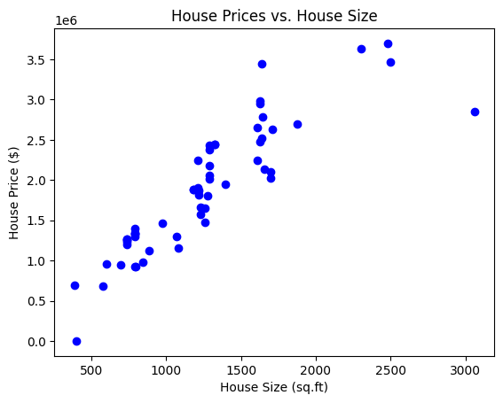
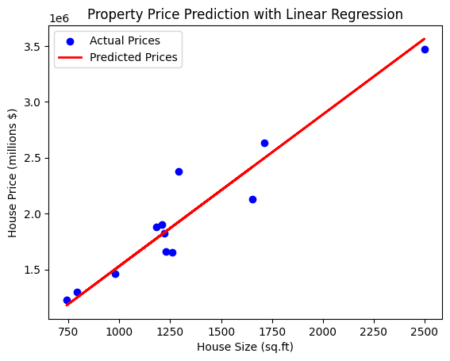

# Housing Prices Predictor by Ishan

## About

This project uses a machine learning model to predict housing prices based on various features. The model is trained on a dataset of housing prices and features, and can be used to make predictions on new, unseen data.

## How it Works

The model uses a linear regression algorithm to predict housing prices based on the input features. The algorithm works by finding the best-fitting line through the data points, and then using this line to make predictions on new data.

Here is a high-level overview of the steps involved in training and using the model:

1. **Data Preprocessing**: The dataset is preprocessed to remove any missing or duplicate values, and to normalize the features.
2. **Model Training**: The model is trained on the preprocessed dataset using a linear regression algorithm.
3. **Model Evaluation**: The model is evaluated on a test dataset to determine its accuracy.
4. **Prediction**: The model is used to make predictions on new, unseen data.

## Model Architecture

The model architecture is a simple linear regression model with the following features:

* **House Size**: The size of the house in square feet.
* **Number of Bedrooms**: The number of bedrooms in the house.
* **Location**: The location of the house, including the city, state, and zip code.

## Graphed Outputs

Here are some graphed outputs from the model:

* **House Price vs House Size**:

## Demo Snapshots

Here are some demo snapshots of the graphed outputs:

## Credits

This project was created by [Ishan Arya](https://github.com/Ish45883)
Credits: [Codedex](https://www.codedex.io/projects/predict-home-prices-with-python-and-linear-regression)

## License

This project is licensed under the MIT License. See the LICENSE file for details.

## Dataset

The dataset used in this project is the [Housing Prices Dataset](https://www.kaggle.com/c/house-prices-advanced-regression-techniques/data) from Kaggle.

*This document was created using the assistance of OpenAI

